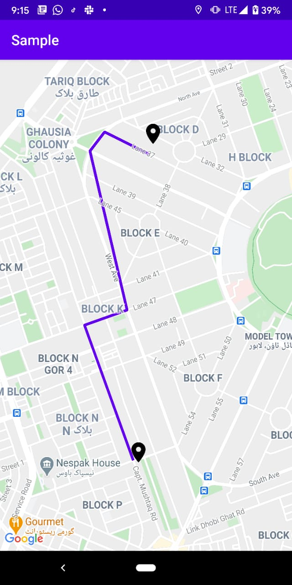

# DrawRoute

[](https://android-arsenal.com/details/1/8158)
[](https://jitpack.io/#malikdawar/drawroute)

DrawRoute is an Android library that simplifies using the [Google Directions API](https://developers.google.com/maps/documentation/directions/). It allows developers to easily draw routes on Google Maps, retrieve estimated times of arrival (ETA), and calculate the suggested distance between two locations flexibly and easily.

> **Note:** You need to generate an API key on the Google Cloud Platform and enable the [Directions API](https://console.cloud.google.com/apis/library). Enjoy!

Read more on [Medium](https://medium.com/better-programming/introducing-drawroute-a-kotlin-library-for-drawing-routes-on-google-maps-for-android-5e6cc99d58f6).

## How to Add

### Using Gradle

1. **Add JitPack to Your Repositories**

   Add the following to your root `build.gradle` at the end of your repositories:

   ```groovy
   dependencyResolutionManagement {
		repositoriesMode.set(RepositoriesMode.FAIL_ON_PROJECT_REPOS)
		repositories {
			mavenCentral()
			maven { url 'https://jitpack.io' }
		}
	}
   ```

3. **Add the Dependency**

   Add the following line to your module's `build.gradle` dependencies section:

   ```groovy
   dependencies {
        implementation 'com.github.malikdawar:drawroute:2.3'
   }
   ```

### Direct Library Usage

If you prefer not to use Gradle, you can include the library/sdk directly in your project.

## Usage

### Basic Route Drawing

First, download the path by providing two points (start and end) and selecting a travel mode.

```kotlin
override fun onMapReady(googleMap: GoogleMap) {
	// Initialize the DrawRouteSDK with your Google Maps API key
	 val drawRouteSDK: DrawRouteSDK = DrawRouteSDKImpl("YOUR_API_KEY_HERE")
        // Define source and destination locations using LatLng
        val source = LatLng(31.48756729419296, 74.30382711498905) // starting point (LatLng)
        val destination = LatLng(31.435732711542265, 74.25902349917489) // ending point (LatLng)
        
        // Configure the Google Map with camera movement, markers, and route drawing
        googleMap.run {
            // Draw the route on the map and get the estimated time of arrival (ETA)
            drawRouteSDK.drawRoute(
                googleMap = googleMap,
                source = source,
                destination = destination,
                context = requireContext(),
                estimates = { leg ->
                    // Handle successful drawing of route and display estimations
                    println("$TAG: drawRoute::estimates ${leg.duration}")
                },
                error = { throwable ->
                    // Handle any errors that occurred during the route drawing
                    println("$TAG: drawRoute::error ${throwable.message}")
                }
            )
        }
    }
```

### Advanced Route Drawing

For more control over the route's appearance and behavior, use the following:

```kotlin
/**
     * Draws a route on the given Google Map from the source location to the destination location.
     *
     * @param googleMap The [GoogleMap] instance where the route will be drawn.
     * @param travelMode The mode of travel to be used for routing. Defaults to [TravelMode.DRIVING].
     * @param source The starting point [LatLng] of the route.
     * @param destination The ending point [LatLng] of the route.
     * @param context The [Context] used for accessing resources.
     * @param color The color of the route line. Defaults to a color defined in resources (R.color.pathColor).
     * @param showMarkers A flag indicating whether markers should be displayed at the source and destination. Defaults to true.
     * @param boundMarkers A flag indicating whether the map should automatically adjust the camera to include both markers. Defaults to true.
     * @param polygonWidth The width of the route line in pixels. Defaults to 7.
     * @param estimates A lambda function to receive the travel estimates (distance and duration) as a [Leg] object.
     * @param error A lambda function to handle errors or exceptions encountered during the operation.
     */
fun drawRoute(
        googleMap: GoogleMap,
        travelMode: TravelMode = TravelMode.DRIVING,
        source: LatLng,
        destination: LatLng,
        context: Context,
        color: Int = context.getColorCompat(R.color.pathColor),
        showMarkers: Boolean = true,
        boundMarkers: Boolean = true,
        polygonWidth: Int = 12,
        estimates: (Leg) -> Unit,
        error: (Throwable) -> Unit,
    )


/**
     * Retrieves travel estimations between the source and destination using the Directions API.
     *
     * @param source The starting point [LatLng] of the route.
     * @param destination The ending point [LatLng] of the route.
     * @param travelMode The mode of travel to be used for routing. Defaults to [TravelMode.DRIVING].
     * @param estimates A lambda function to receive the travel estimates (distance and duration) as a [Leg] object.
     * @param error A lambda function to handle errors or exceptions encountered during the operation.
     */
fun getTravelEstimations(
        source: LatLng,
        destination: LatLng,
        travelMode: TravelMode = TravelMode.DRIVING,
        estimates: (Leg) -> Unit,
        error: (Throwable) -> Unit,
    )

 /**
     * Remove the paths from maps.
     * @return nothing
     */
    fun removePaths()

```

### Travel Modes

The library supports various travel modes:

```kotlin
enum class TravelMode {
    DRIVING, WALKING, BICYCLING, TRANSIT
}
```

### Route Estimations

If you only need is the to get travel estimations (distance and ETA) within your Activity or Fragment:

```kotlin

	// Define source and destination locations using LatLng
        val source = LatLng(31.48756729419296, 74.30382711498905) // starting point (LatLng)
        val destination = LatLng(31.435732711542265, 74.25902349917489) // ending point (LatLng)

        // example: to fetch travel estimations between source and destination using the DrawRouteSDK
        drawRouteSDK.getTravelEstimations(
            source = source,
            destination = destination,
            travelMode = TravelMode.DRIVING,
            estimates = { leg ->
                // Handle the successful retrieval of travel estimations
                println("$TAG: getTravelEstimations::estimates ${leg?.duration}")
            },
            error = { throwable ->
                // Handle any errors that occurred during the estimation retrieval
                println("$TAG: getTravelEstimations::error ${throwable.message}")
            }
        )

```

## Complete code

Here is the [complete code example](https://github.com/malikdawar/drawroute/blob/master/app/src/main/java/com/maps/sample/RouteFragment.kt). This Sample app covers the following examples: 1. Get Travel Estimates 2. Draw a Route between locations 3. Remove Route/Path from maps


## Screenshots

Here is a screenshot of the DrawRoute library in action:



## Developed By

**Malik Dawar**  
[malikdawar332@gmail.com](mailto:malikdawar332@gmail.com)
